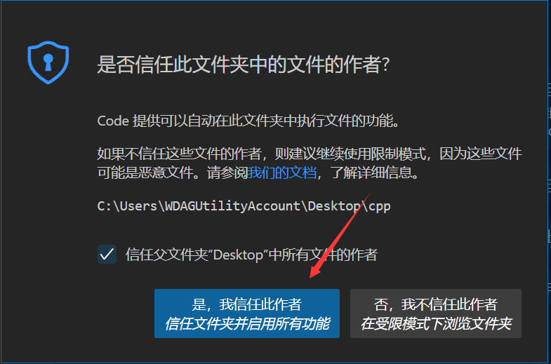

# 【教程】如何在 VSCode 中调试C++程序

>   文章最后更新日期：2022年12月10日，请确保文章时效性

**本文章所述内容均为Windows 11操作系统，VSCode版本1.68.1中文语言下，请注意时效性问题。书樱不对时效性问题产生的变化负责。本教程不会教您有关 GCC、GDB、MinGW-w64 或 C++ 语言的相关知识。对于这些问题，在互联网上上有很多简单易懂的资源。**

## 序言

这篇文章是写给那些，包括书樱在内，对于 VSCode 不太了解，但是又迫切的需要一个比 Visual Studio 安装和开发更加简便的、想要学习 C++ 的小白。同时，也是献礼给即将在大学进入计算机专业的准大学生。

通常我们在学习 C/C++时，第一节课接触的都是`Hello World`程序，而不是实现这个程序的编译过程。当然，你可以无脑安装 Visual Studio 因为他是一个帮我们配置好所有配置的 IDE（Integrated Development Environment，集成开发环境）。但是，对于大部分来说，Visual Studio 可能都过于庞大，因为我们只需要一个简单的编译器，而不需要其背后的其他功能和工具。

这也就是书樱写这篇教程的目的，恭喜你，如果你想找一个 Visual Studio 的替代品或者使用一些更”现代“的开发工具。那么你找对地方了，请跟随书樱的脚步，继续往下阅读。

> 这篇文章很大程度上启发自官方文档，部分内容由官方文档指导而来或自官方文档翻译：

- Get Started with C++ and MinGW-w64 in Visual Studio Code [[1]][1]
- Debug C++ in Visual Studio Code [[2]][2]
- Configure launch.json for C/C++ debugging in Visual Studio Code [[3]][3]

这是书樱第一次尝试写教程类的文章，如果有书樱有任何未写清楚或您不懂的地方，欢迎[联系我们](/contact-us)。

如果您觉得我写的东西对您有所帮助的话，不妨请我喝杯咖啡。=> [赞助](/support "赞助")

话不宜迟，进入正题。

## 准备

- 一台电脑
- 一个稍动脑筋的脑子
- 一颗乐于解决问题的心
- 一架高速访问国际互联网的梯子（可选）

接下来，我们来下载我们所需要的东西：

-   VSCode 或 VSCodium
-   编译器

### 什么是VSCode

Visual Studio Code（简称 VS Code）是一款由微软开发且跨平台的免费源代码编辑器。该软件支持语法高亮、代码自动补全（又称 IntelliSense）、代码重构功能，并且内置了命令行工具和 Git 版本控制系统。用户可以更改主题和键盘快捷方式实现个性化设置，也可以通过内置的扩展程序商店安装扩展以拓展软件功能。[[4]][4]

**官网：https://code.visualstudio.com/**

上面是 VSCode 的官网链接，在中国大陆的下载速度可能会很感人，因此书樱在此更推荐 VSCodium。

### 什么又是VSCodium

VSCodium 是 VSCode 的一个开源分支，由一群社区志愿者维护和开发。与 VSCode 相同，二者都是一款免费的文本编辑器，提供了丰富的功能，支持多种编程语言和开发框架。但不同的是，VSCodium 去除了 VSCode 中一些微软特有的功能和服务，比如集成 Azure 和 Live Share 等，因此它更为轻量级和自由，可以给开发人员提供更为自由的使用体验。

VSCodium 的功能和 VSCode 相当接近，两者都可以提供类似的开发体验，你可以根据自己的喜好选择使用 VSCode 或 VSCodium。

**官网：https://vscodium.com/**

对于VSCodium，好在[清华大学开源软件镜像站](https://mirrors.tuna.tsinghua.edu.cn/)有他对应的镜像。我们可以通过镜像获得更快的下载服务。

[清华大学开源软件镜像站](https://mirrors.tuna.tsinghua.edu.cn/)


### 我该如何选择二者？

VSCode 是由微软开发并维护的，包含了一些微软特有的功能和服务，如集成 Azure 和 Live Share 等。这些功能对于那些需要使用微软产品和服务的开发人员来说，可能会非常有用。

VSCodium 去除了 VSCode 中的微软链接，因此它提供了更为自由的使用体验。如果你希望避免使用微软产品和服务，或者希望获得更为轻量级的文本编辑器，那么 VSCodium 可能是一个不错的选择。

总而言之，对于没有这方面需求的人来说，二者之间并没有什么区别，如果你访问 VSCode 速度过慢，不妨可以选择 VSCodium。

### 编译器

编译器（compiler）是一种计算机程序，它会将某种编程语言写成的源代码（原始语言）转换成另一种编程语言（目标语言）。它主要的目的是将便于人编写、阅读、维护的高级计算机语言所写作的源代码程序，翻译为计算机能解读、运行的低阶机器语言的程序，也就是可执行文件。编译器将原始程序（source program）作为输入，翻译产生使用目标语言（target language）的等价程序。[[5]][5]

想要在VSCode中调试C++程序，理所应当的，我们需要 C++ 编译器和 GDB 调试器来创建在 Windows 上运行的程序。

常见的 C++ 编译器包括：

-   GCC：GNU Compiler Collection，由 GNU 项目维护的免费开源 C++ 编译器。
-   Clang：由苹果公司开发的开源 C++ 编译器。
-   Visual C++：微软公司推出的商业 C++ 编译器。
-   Borland C++：Borland 公司推出的商业 C++ 编译器。
-   Turbo C++：Borland 公司推出的商业 C++ 编译器。

>   选择哪种 C++ 编译器取决于你的需求和喜好。如果对编译器的性能和功能要求不高，可以选择免费开源的编译器，比如 GCC 和 Clang。如果希望获得更高性能和更丰富的功能，可以选择商业编译器，比如 Visual C++ 和 Borland C++。

不过对于本文而言，我们选择 GCC 编译器。首先，GCC 有着广泛的社区支持，我们可以通过社区获得帮助和支持；其次， GCC 编译器具有良好的性能和功能，可以帮助我们快速编译 C++ 源代码，并且在编译过程中发现一些语法错误和类型错误等问题。

### MSYS2

MSYS2 是一种基于 MinGW-w64 的类 Unix 环境，可以在 Windows 下为开发人员提供一系列工具和库。它包含了一个可以安装和管理软件包的包管理器，并提供了一个可以编译和运行 Unix-like 程序的 shell 环境。

>   MSYS2 is a collection of tools and libraries providing you with an easy-to-use environment for building, installing and running native Windows software.[[6]][6]

>   MinGW 的全称是：Minimalist GNU on Windows 。它实际上是将经典的开源 C语言 编译器 GCC 移植到了 Windows 平台下，并且包含了 Win32API ，因此可以将源代码编译为可在 Windows 中运行的可执行程序。而且还可以使用一些 Windows 不具备的，Linux平台下的开发工具。一句话来概括：MinGW 就是 GCC 的 Windows 版本 。[[7]][7]
>
>   而MinGW-w64则是对原始 mingw.org 项目的改进，旨在支持 Windows 系统上的 GCC 编译器。为了提供对 64 位和新 API 的支持，它在 2007 年对其进行了分叉。[[8]][8]

MSYS2 还提供了一个可以安装和管理软件包的包管理器，可以让我们方便地安装、更新和卸载软件包。它还提供了一个简单易用的命令行界面，可以让开发人员快速访问常用的工具和库，我们需要的 GCC 编译器就在其中。

MSYS2官方有对于该应用的[安装教程](https://www.msys2.org/wiki/MSYS2-installation/ "MSYS2-Installation - MSYS2")，有能力的读者可以自行阅读。

**官网：https://www.msys2.org/**

以下是MSYS2安装程序的GitHub仓库：

[mdx_github author="msys2" project="msys2-installer" gateway="https://api-github.sakurapuare.workers.dev/"][/mdx_github]

当然，对于中国大陆用户，以上页面也许连打开都成困难。好在我们的[清华大学开源软件镜像站](https://mirrors.tuna.tsinghua.edu.cn/)又给我们准备了镜像链接。

**下载链接：https://mirrors.tuna.tsinghua.edu.cn/msys2/distrib/msys2-x86_64-latest.exe**

### 小结

通过以上内容，我们准备好了：

-   VSCode 或 VSCodium 的安装包
-   MSYS2 的安装包

确认完毕后，请前往下一小节。

## 安装

以下环节运行于 Windows 沙盒中，可能于实际环境有所不同。

请确保以上环节的安装包都下载完成。


### 安装 MSYS2

下载完成后安装 MSYS2


选择对应的安装文件夹，注意文件夹路径**不能有中文等特殊字符**：

***若您选择了非默认路径`C:\msys64`安装，请确保您能完成之后的安装步骤。***

一路 Next 等待安装：


由于我们的MSYS2只是一个包管理工具，所以现在我们进行的才是 GCC 译器的安装：


输入并执行`pacman -Syu`，以更新包数据库和基础包，在下载过程中请耐心等待。


在完成之后会提示关闭终端以完成更新，请输入`{y}`或`{Enter}`以确认。

```bash
:: To complete this update all MSYS2 processes including this terminal will be closed. Confirm to proceed [Y/n]
```

之后再重新打开 MSYS2 终端~~（你应该知道去哪里打开吧，对吧）~~，我们再输入`pacman -S mingw-w64-x86_64-gcc mingw-w64-x86_64-gdb`，安装MinGW-w64 GCC编译器：


更新过程中需要输入`{y}`或`{Enter}`以确认安装，由于安装包数量多，可能需要较长的时间完成，请耐心等待。

安装完成之后就可以关闭终端了。

### 配置环境变量

在安装完 GCC 编译器之后，其实还不够。配置环境变量是为了让操作系统和程序能够正确地找到需要使用的文件和库，以及让操作系统能够找到编译器可执行文件的位置。否则，在命令行中输入编译命令时，操作系统可能找不到编译器，导致编译失败。

在Windows 搜索框中输入**”环境变量“****或**“env”**，点击第一个**编辑系统环境变量**（在英文版系统下为**Edit the system environment variables**）


在打开的环境变量窗口中，在**“用户变量”**部分下方先选择`Path`条目，再点击**“编辑”**。


请输入`C:\msys64\mingw64\bin\`，如果你修改了 MSYS2 的安装路径，请自行调整路径。


接下来一路确定返回，最好重启一次计算机。

### 安装 VSCode 或 VSCodium

#### VSCode

接下来我们来安装 VSCodium，一路 Next 就行，~象征性配几张图~。


####  VSCodium

接下来我们来安装 VSCodium，一路 Next 就行，~象征性配几张图~。


### 配置 VSCode

根据前文所说，VSCode 和 VSCodium 本质上没有什么区别，所以以下书樱以 VSCode 作为演示。

打开您的 VSCode，如果如下图所示为英文，请前打开扩展市场，搜索**“Chinese”**，安装VS Code 的中文（简体）语言包。


右下加会弹出提示告诉你重启 VSCode 以改变界面语言。


打开扩展市场，搜索**“c++”**安装官方C++扩展插件。


到这一步 VSCode 就算安装完成了。

## 配置编译与调试

在 VSCode 中有两种调试方法，一种是在不生产配置文件的情况下，直接启用调试；另一种是生成特定的配置文件，根据配置文件中的条目进行编译和调试。

### 单文件调试

现在，书樱已经打开了一个 C++ 源文件，它向控制台输出一个`Hello World`并换行。

```c++
#include <iostream>
using namespace std;

int main()
{
    cout << "Hello World" << endl;
    return 0;
}
```

想要进行编译和调试，你可以直接按快捷键`{F5}`，也可以选择**运行与调试**选项卡中的**运行和调试**，接着选择**“C++ (GDB/LLDB)“**，进行调试。


接着选择对应的调试器，通常来说，如果你进行的是纯 C 语言的开发，否则都应该选择 g++ 编译器。


> 更加严谨一点，gcc 和 g++ 都能用于 C/C++ 语言的编译。对于后缀为 .c 的程序，gcc 会默认作为 C 语言程序，g++ 会认为是 C++ 语言程序；而后缀为 .cpp 的程序，两者都会认为是 C++ 语言程序。不同的是，在链接过程中，gcc 默认不会链接 C++ 的标准库，而 g++ 会默认告诉链接器链接上 C++ 标准库。

程序成功给我们输出了`Hello World`！


### 配置文件

**配置 VSCode 的配置文件是实现 VSCode 调试的关键，也是本教程的难点所在**

要进行配置文件调试编译，你需要新建一个文件夹以保存 VSCode 的配置文件，本教程中为`CPP`。

在更新的 VSCode 版本中，你还会遇到信任文件夹窗口，请大胆“信任文件夹并启用所有功能”。



VSCode进行调试的流程遵循下图：


文件夹应该如图所示，`.vscode`为 VSCode 自动生成的用于存放配置文件：


#### 配置 tasks.json

为了让VSCode知道我们在调试C++程序，创建一个`hello.cpp`：


在打开`hello.cpp`下，在标题栏 "终端" -> "配置任务"中，选择 **C/C++: g++.exe 生成活动文件**：


生成如下：

`tasks.json`

```json
{
	"version": "2.0.0",
	"tasks": [
		{
			"type": "cppbuild",
			"label": "C/C++: g++.exe 生成活动文件",
			"command": "C:\\msys64\\mingw64\\bin\\g++.exe",
			"args": [
				"-fdiagnostics-color=always",
				"-g",
				"${file}",
				"-o",
				"${fileDirname}\\${fileBasenameNoExtension}.exe"
			],
			"options": {
				"cwd": "C:\\msys64\\mingw64\\bin"
			},
			"problemMatcher": [
				"$gcc"
			],
			"group": "build",
			"detail": "编译器: C:\\msys64\\mingw64\\bin\\g++.exe"
		}
	]
}
```

**Q: 为什么我没有显示 *C/C++: g++.exe 生成活动文件***
**A: 因为您没有正确安装好 g++ 或没有安装到默认路径，VSCode 没有识别到您的 g++。这种情况下请您重新安装或自行复制以下内容并配置好 g++ 的路径，具体为`command`条目。**

而`detail`条目则是当前调试项目的备注，可选择更改。

**如果是用斜杠作为分隔符，请使用双斜杠`//`或者反斜杠`\`，不要使用单斜杠`/`，如果使用单斜杠`/`，斜杠本身将会和后面的字符一起被VSCode转义为其他字符**

```json
{
    "version": "2.0.0",
    "tasks": [
        {
            "type": "cppbuild",
            "label": "C/C++: g++.exe 生成活动文件",
            "command": "C:\\msys64\\mingw64\\bin\\g++.exe",
            "args": [
                "-fdiagnostics-color=always",
                "-g",
                "${file}",
                "-o",
                "${fileDirname}\\${fileBasenameNoExtension}.exe"
            ],
            "options": {
                "cwd": "${fileDirname}"
            },
            "problemMatcher": [
                "$gcc"
            ],
            "group": "build",
            "detail": "编译器: C:\\msys64\\mingw64\\bin\\g++.exe"
        }
    ]
}
```

#### 配置 launch.json

切换到调试选项卡，选择 **“创建launch.json”** 开始配置调试：

选择`C++(GDB/LLDB)`:


在右下角选择`添加配置`，并选择`C/C++：(gdb)启动`:


点击后，VSCode给我们自动配置如下:

```json
{
    // 使用 IntelliSense 了解相关属性。
    // 悬停以查看现有属性的描述。
    // 欲了解更多信息，请访问: https://go.microsoft.com/fwlink/?linkid=830387
    "version": "0.2.0",
    "configurations": [
        {
            "name": "(gdb) 启动",
            "type": "cppdbg",
            "request": "launch",
            "program": "输入程序名称，例如 ${workspaceFolder}/a.exe",
            "args": [],
            "stopAtEntry": false,
            "cwd": "${fileDirname}",
            "environment": [],
            "externalConsole": false,
            "MIMode": "gdb",
            "miDebuggerPath": "/path/to/gdb",
            "setupCommands": [
                {
                    "description": "为 gdb 启用整齐打印",
                    "text": "-enable-pretty-printing",
                    "ignoreFailures": true
                },
                {
                    "description":  "将反汇编风格设置为 Intel",
                    "text": "-gdb-set disassembly-flavor intel",
                    "ignoreFailures": true
                }
            ]
        }
    ]
}
```

**第一步：调整`program`条目，配置gdb调试的文件名。**

`program`条目指向的是我们要调试的程序，这里则是我们上一布编译生成的活动文件。

在上一节中，系统配置的 g++ 编译参数为`-o ${fileDirname}\\${fileBasenameNoExtension}.exe `，生成的则是在 VSCode 中打开的文件夹路径下的当前打开的活动文件的文件名。

所以，将`program`的**`输入程序名称，例如 ${workspaceFolder}/a.exe`**，改为**`${fileDirname}/${fileBasenameNoExtension}.exe`**，并注意保留两侧的英文双引号。

```json
            "request": "launch",
            "program": "${fileDirname}/${fileBasenameNoExtension}.exe",
            "args": [],
            "stopAtEntry": false,
            "cwd": "${fileDirname}",
```

VSCode 为我们保留了许多预定义变量，可以被我们在配置文件中直接使用：[[9]][9]

- **`${userHome}`** - 用户主文件夹的路径
- **`${workspaceFolder}`** - 在 VSCode 中打开的文件夹的路径
- **`${workspaceFolderBasename}`** - 在 VS Code 中打开的文件夹的名称，不带任何斜杠 (/)
- **`${file}`** - 当前打开的文件
- **`${fileWorkspaceFolder}`** - 当前打开的工作区文件夹
- **`${relativeFile}`** - 相对于**`${workspaceFolder}`**的当前打开的文件路径
- **`${relativeFileDirname}`** - 相对于**`${workspaceFolder}`**的当前打开的文件夹路径
- **`${fileBasename}`** - 当前打开文件名
- **`${fileBasenameNoExtension}`** - 当前打开的无文件扩展名的文件名
- **`${fileDirname}`** - 当前打开文件的目录名
- **`${fileExtname}`** - 当前打开文件的扩展名
- **`${cwd}`** - 运行任务时的当前工作目录
- **`${lineNumber}`** - 活动文件中当前选定的行号
- **`${selectedText}`** - 活动文件中当前选定的文本
- **`${execPath}`** -  正在运行的 VS Code 可执行文件的路径
- **`${defaultBuildTask}`** - 默认运行任务的名称
- **`${pathSeparator}`** - 操作系统用来分隔文件路径中的组件的字符

所以，配置程序可执行文件的完整路径时，将会自动替换为`CPP/hello.exe`，gdb 将会对此文件进行调试。

**第二步：调整`miDebuggerPath`条目，配置`gdb`的文件路径。****

如果你的 MSYS2 安装路径为默认，那么这一步的 gdb.exe 的路径将会是`C:\\msys64\\mingw64\\bin\\gdb.exe`，如果你的安装路径不是系统默认，请自行配置`gdb`的绝对路径。

```json
            "externalConsole": false,
            "MIMode": "gdb",
            "miDebuggerPath": "C:\\msys64\\mingw64\\bin\\gdb.exe",
            "setupCommands": [
                {
```

**第三步：添加`preLaunchTask`条目，并配置执行任务**

- **`preLaunchTask`** - 要在调试会话开始之前启动的任务，这里指向的就是我们上一小节中创建的`C/C++: g++.exe 生成活动文件`

由于我们在上一小节中，系统自动生成的标签（`lable`）为：`C/C++: g++.exe 生成活动文件`，所以在这里我们需要添加一条条目，并保存如下：

```json
            "MIMode": "gdb",
            "miDebuggerPath": "C:\\msys64\\mingw64\\bin\\gdb.exe",
            "preLaunchTask": "C/C++: g++.exe 生成活动文件",
            "setupCommands": [
                {
```

### 完成

完成上述步骤后，切换到`hello.cpp`，轻按下`{F5}`，享受由 VSCode 带来的便捷调试吧！

## 小结

要实现在 VSCode 上调试 C/C++ 代码，首先 VSCode 通过`launch.json`中的`preLaunchTask`条目，使用 g++ 将 C++ 代码编译成可执行文件；接着在用 gdb 调试器对可执行文件进行调试，最后完成在VSCode上开发 C++ 的功能。

相比与一些罐头式的 C++ IDE，如Code blocks，Dev-C++，VSCode的配置相对来说会比较麻烦一点。但VSCode 作为一个全功能的编辑器，能够满足不同类型的开发者的需求。同时 VSCode 界面美观，操作方便，并且能够定制主题和外观，还拥有着丰富的插件市场，可以根据个人需求安装各种插件，以提高编辑器的功能。最后，VSCode 还提供了强大的智能提示功能，能够帮助开发者快速完成编码，提高开发效率。

作为轻量，几乎万能的 编辑器，相比于Visual Studio这种适合大宗项目开发的 IDE 来说，VSCode 更加适合在平时学习中对 C++ 短代码的测试以及 C++ 语言的学习，理所应当是我们的不二之选。

## 参考

1. [Get Started with C++ and Mingw-w64 in Visual Studio Code](https://code.visualstudio.com/docs/cpp/config-mingw)
2. [Debug C++ in Visual Studio Code](https://code.visualstudio.com/docs/cpp/cpp-debug)
3. [Configure launch.json for C/C++ debugging in Visual Studio Code](https://code.visualstudio.com/docs/cpp/launch-json-reference)
4. [Visual Studio Code - 维基百科，自由的百科全书](https://zh.wikipedia.org/zh-cn/Visual_Studio_Code)
5. [编译器 - 维基百科，自由的百科全书](https://zh.wikipedia.org/zh-cn/%E7%B7%A8%E8%AD%AF%E5%99%A8)
6. [MSYS2](https://www.msys2.org/)
7. [MinGW-w64安装教程 - 简书](https://www.jianshu.com/p/d66c2f2e3537)
8. [MinGW-w64](https://www.mingw-w64.org/)
9. [Visual Studio Code Variables Reference](https://code.visualstudio.com/docs/editor/variables-reference)

[1]: https://code.visualstudio.com/docs/cpp/config-mingw "Get Started with C++ and Mingw-w64 in Visual Studio Code"
[2]: https://code.visualstudio.com/docs/cpp/cpp-debug "Debug C++ in Visual Studio Code"
[3]: https://code.visualstudio.com/docs/cpp/launch-json-reference "Configure launch.json for C/C++ debugging in Visual Studio Code"
[4]: https://zh.wikipedia.org/zh-cn/Visual_Studio_Code "Visual Studio Code - 维基百科，自由的百科全书"
[5]: https://zh.wikipedia.org/zh-cn/%E7%B7%A8%E8%AD%AF%E5%99%A8 "编译器 - 维基百科，自由的百科全书"
[6]: https://www.msys2.org/ "MSYS2"
[7]: https://www.jianshu.com/p/d66c2f2e3537 "MinGW-w64安装教程 - 简书"
[8]: https://www.mingw-w64.org/ "MinGW-w64"
[9]: https://code.visualstudio.com/docs/editor/variables-reference "Visual Studio Code Variables Reference"
